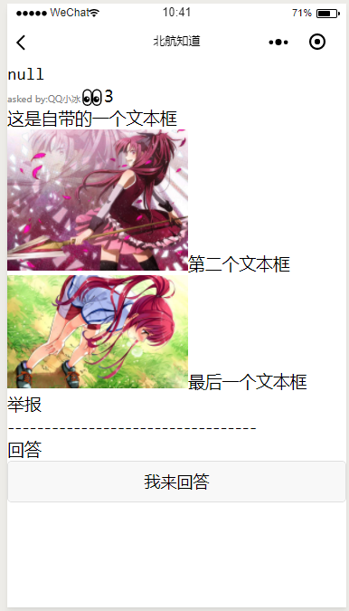

# papaya_mina

## 2019.8.12
目前我已经完成了所有的踩坑工作，基本上所有的东西都做完了。
但是我不想再写一遍回答的部分了，各位依样画葫芦吧。

## Regrets
有一些遗憾

1. 虽然可以发图片了，但是还是很不爽，因为竟然不能回复。是不是应该可以回复？



## How to parse a dom?
参考微信相关文档和代码中的注释。
rich-text支持的是html元素而不是微信小程序内部的元素，名称和属性是不同的，详情参考文档:
[微信官方文档 rich-text](https://developers.weixin.qq.com/miniprogram/dev/component/rich-text.html)

具体的dom思路参考papaya_flask的[how_to.md](https://github.com/holazzer/papaya_flask/blob/v1/how_to.md)


### tips:
1. 解决自动换行的问题:在dom树的图片外面再套一层div
2. 使用\<br>进行换行，这是允许的
3. 使用\<hr>可以添加html式的分割线


另外注意:
1. 现在发回服务器的数据是stringified JSON,你在前端拿到之后，需要先parse一下,用来显示摘要，要不然就很难看了。
2. ...想到再说吧


## 关于重写dom的决定
2019.8.14

经过认真的考虑，本人决定将会沿用之前的body储存纯文本，新增加一个dom_string属性作为rich-tex显示用。


为什么要这样做呢？

搜索时是基于全文搜索，你的dom里有大量的text，img等字眼，影响搜索


## 关于重写图片上传操作的决定
2019.8.14

之前的做法实在是太傻了，竟然是先上传后显示，这样做是很傻的。应该是最后上传才对。


### 今日踩坑

本来想做一个先上传图片再上传dom的，结果发现这样做上传的只有text

原因在于，上传图片是异步操作，所以你传图片的时候，text已经传完了

所以你这里得需要一个回调


你必须得用Promise

例子:

```js
submit:function(e){
    //converting my dom to a wx-granted nodes
    const promise = new Promise((resolve,reject)=>{
      var nodes = [];
      var text = '';
      var dom = this.data.dom;
      for (let i = 0; i < dom.length; i++) {
        if (dom[i]) {
          if (dom[i].type == 'text') {
            text += dom[i].value;
            nodes[nodes.length] = dom[i];
            if(i==dom.length-1){
                  console.log(nodes);
                  resolve({msg:'success',nodes:nodes,text:text});
                }
          } else if (dom[i].type == 'img') {
            // upload the picture
            wx.uploadFile({
              url: app.globalData.domain + '/upload/post_pic',
              filePath: dom[i].value,
              name: 'pic',
              header: {
                "Content-Type": "multipart/form-data"//记得设置
              },
              formData: {
                'user_id': app.globalData.user_id,
                'token': app.globalData.token
              },
              success: res => {
                console.log(res);
                e = JSON.parse(res.data);
                // 要记得把新的img_url给img
                dom[i].value = app.globalData.domain + e.url;
                nodes[nodes.length] = dom[i];
                console.log('nodes', i, nodes);
                if(i==dom.length-1){
                  console.log(nodes);
                  resolve({msg:'success',nodes:nodes,text:text});
                }
              }
            })
          }
        }
      }
    });
    promise.then(res=>{
      console.log(res);
      const body = JSON.stringify(res.nodes);
      console.log('body', body);
      wx.request({
        url: app.globalData.domain + '/mina_api/ask',
        data: {
          user_id: app.globalData.user_id,
          token: app.globalData.token,
          dom: body,
          body: res.text,
          title: this.data.title,
          is_urgent: this.data.is_urgent,
          tags: ''
        },
        header: {
          "Content-Type": "application/json"
        },
        success: res => {
          console.log(res);
          wx.showToast({
            title: '发布成功', duration: 1500
          });
          wx.navigateBack();
        }
      });
    })
  }
```
必须得等所有的图片都上传完了才行


### 继续踩坑
上面的代码是错的。不能这样写。
只能是所有的图片全部上传完了，拿到了自己的url，再开始整体的上传。